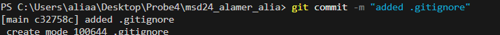
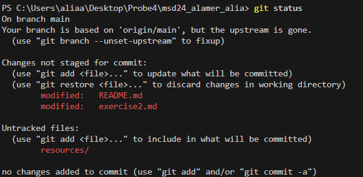
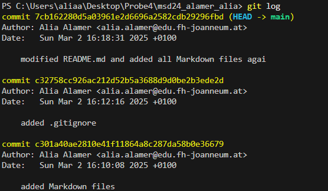
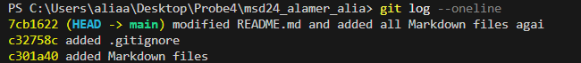
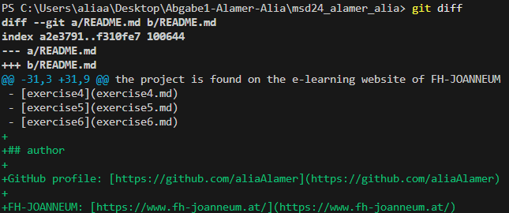

# git commands

- _git config_: this command sets up your Git with your name and email.
This command should be used once. with every commit the name and email are stored, making it easy to see who performed the commit
  - git config --global user.name "your name"
  - git config --global user.email "<youremail@example.com>"
- _git init_: starts a new git project in a folder (creates a .git folder)

- _git commit_: saves your changes in git with a meassage

- _git status_: shows which files changed and need to be added or commited

- _git add_: adds specific files or all changes to be commited
  - **git add .**:adds everything
  - **git add (filename)**: adds specific files

- _git log_: shows the history of commits. it shows who chaged what and when the changes happend

- _git diff_: shows the difference between files. it shows what changed

- _git pull_: downloads the latest chnages from a remote repository like GitHub
- _git push_: uploads the changes you did to a remote repository
