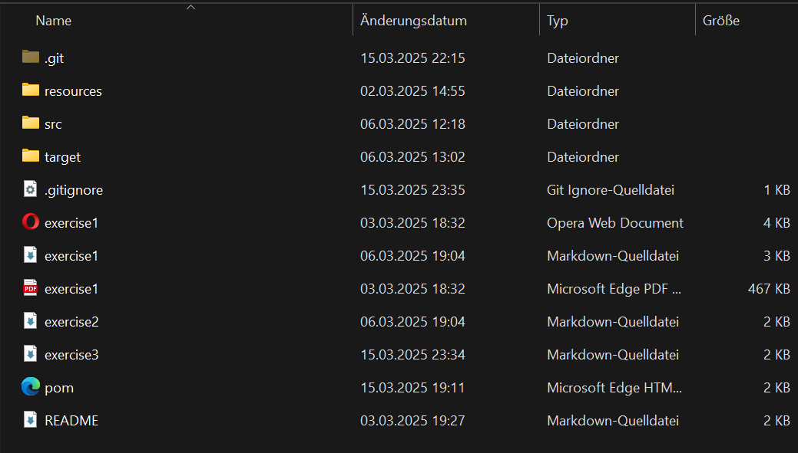
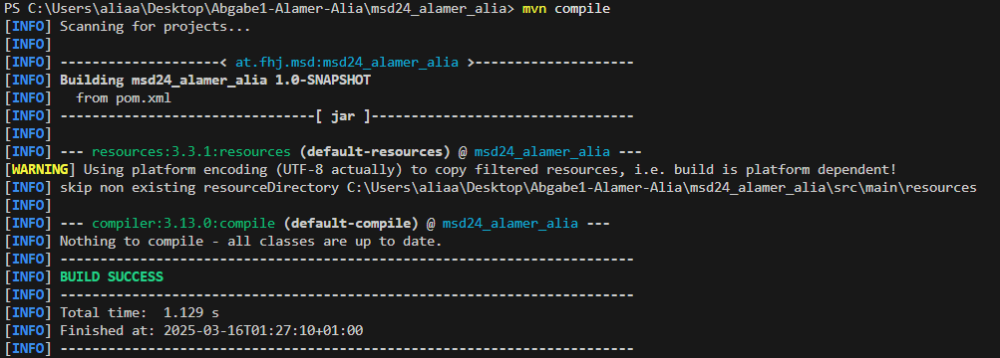
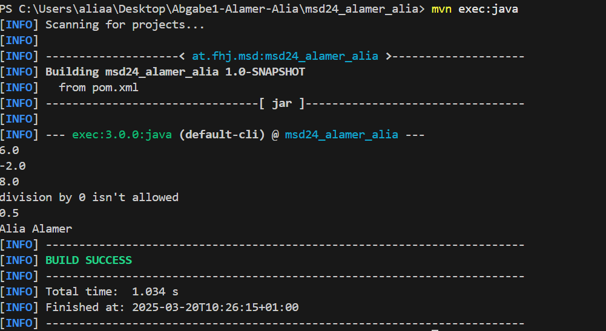

# exercise 3

this file documents every task that will be done in this exercise.

## TASKS

### update .gitignore

add the target directory to .gitignore. it contains:

- compiled code: the main code compiled into .class files and also test code
- build artifacts: files generated during the build process
- .idea: this is a folder specific to IntelliJ IDEA and contains local IDE configurations.

    ```plaintext
    target/
    ```

### create a Calculator Class & Main Class

- this Class should be created in the package at.fhj.msd
- it should implement 4 methods that allow us to do simple mathimatical operations

```java
 public double add(double number1, double number2){ ... }

 public double minus(double number1, double number2){ ... }

 public double multiply(double number1, double number2){ ... }

 public double divide(double number1, double number2){ ... }
```

the main class has a Main method where Calculator methods are called and the results are printed in the console

- after executing the code the target/ directory appears. this folder contains
  - compiled .class files
  - build artifacts generated during the build process
- the reason why the folder existed before this execution:
At the beginnig of this exercise I executed the already existing code in Main.java (System.out.println("Hello World!")) and i guess this triggered the build process and created the target folder.

- **project structure**



### modifying pom.xml

- added the maven-compiler-plugin dependency
- then added the build section with plugin configuration

- the block that was added is to configure the maven-compiler-plugin to compile the java code
  - groupid: identifies the group that maintains the plugin
  - artifactid: specifies the plugin name
  - version: defines the plugin version
  - configuration: configures how the plugin behaves during the build
  - release: specifies the java version to compile against
- the goal is to ensure the project is built using the correct java version
- next step was to run **mvn compile** in the console to build the project



### modifying pom.xml: added another plugin

- added the exec-maven-plugin: allows you to execute java applications directly from maven without packiging them into a JAR file.
  - how it works:
    1. compilation: Maven compiles your code
    2. execution: the plugin runs the specified mainClass with its main method
    3. classpath: all dependencies and resources are automatically included
- after adding the plugin the following command should be executed:

```plaintext
mvn exec:java  
```


