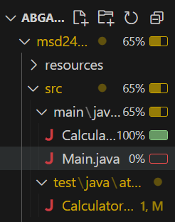
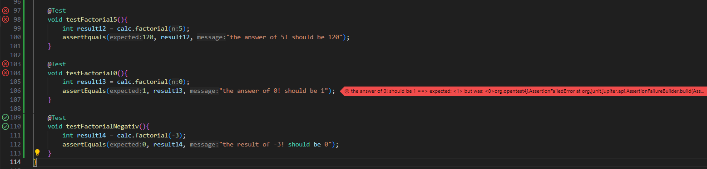

# exercise 4

this file documents describes the test cases that were done for the Calculator. Every arithmetic operation has been tested with 3-4 different test cases.

## Test cases

### Addition

| Method | Description | Input | Expected Result |
|--------|-------------|-------|-----------------|
| testAddValues | test normal addtion | 2, 2 | 4 |
| testAddNegativNum | test addition with negativ number | 2, -4 | -2 |
| testAddWithZero | test addition with 0 | 2, 0 | 2 |

### Subtraction

| Method | Description | Input | Expected Result |
|--------|-------------|-------|-----------------|
| testSubValues | test normal subtraction | 4, 2 | 2 |
| testSubNegativeNum | test subtraction with negativ number | 2, -4 | 6 |
| testSubWithZero | test subtraction with 0 | 0, 2 | -2 |

### Multiplication

| Method | Description | Input | Expected Result |
|--------|-------------|-------|-----------------|
| testMultiplyValues | test normal multiplication | 2, 2 | 4 |
| testMultiplyNegativeNum | test multiplication with negativ number | 2, -2 | -4 |
| testMultiplyWithZero | test multiplication with 0 | 2, 0 | 0 |

### Division

| Method | Description | Input | Expected Result |
|--------|-------------|-------|-----------------|
| testDivValues | test normal division | 4, 2 | 2 |
| testDivNegativeNum | test division with negativ number | 4, -2 | -2 |
| testDivWithZero | test division with 0 | 0, 2 | 0 |
| exceptionTest | test division by 0 | 4, 0 | throw ArithmeticException |

- I tested the exception because i wanted to know how it works. i didn't know how to do it so i looked it up on stackoverflow:
  - [testing exception](https://stackoverflow.com/questions/156503/how-do-you-assert-that-a-certain-exception-is-thrown-in-junit-tests)

### Testcoverage



### TDD - test-driven development

- it's a coding approach where you write tests first and then the code to make them pass. it follows a 3-step cycle:
  1. Red: write a failing test. A test for a not existing code. this ensures the test actually checks what you want
  2. Green: write minimal code to pass the test
  3. Refactor: clean up the code while keeping the same functionality (optimize the code)

### the second task step-by-step

- create a not complete factorial method

```java
public int factorial(int n){
      return 0;
     }
```

- write tests

- 3 tests
  - factorial(5) -> Fails (expected 120, got 0)
  - factorial(0) -> Fails (expected 1, got 0)
  - factorial(-3) -> Fails (expected 0, got 0) ==> the test excepts 0 for negative inputs and my method always returns 0 for all inputs that is why this test passes but for the wrong reason



- corrected the factorial method

```java
 public int factorial(int n){
      if(n < 0){
         return 0;
      }
      if(n == 0){
         return 1;
      }
      return n * factorial(n-1);
     }
```

- after correcting the method all tests passed
